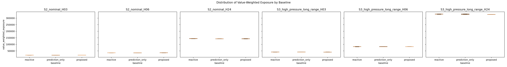
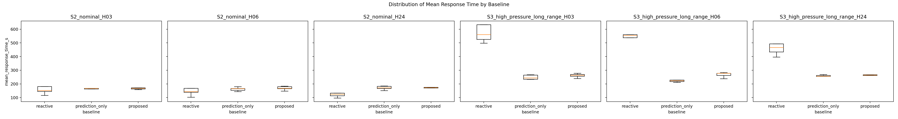
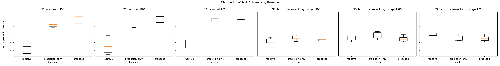
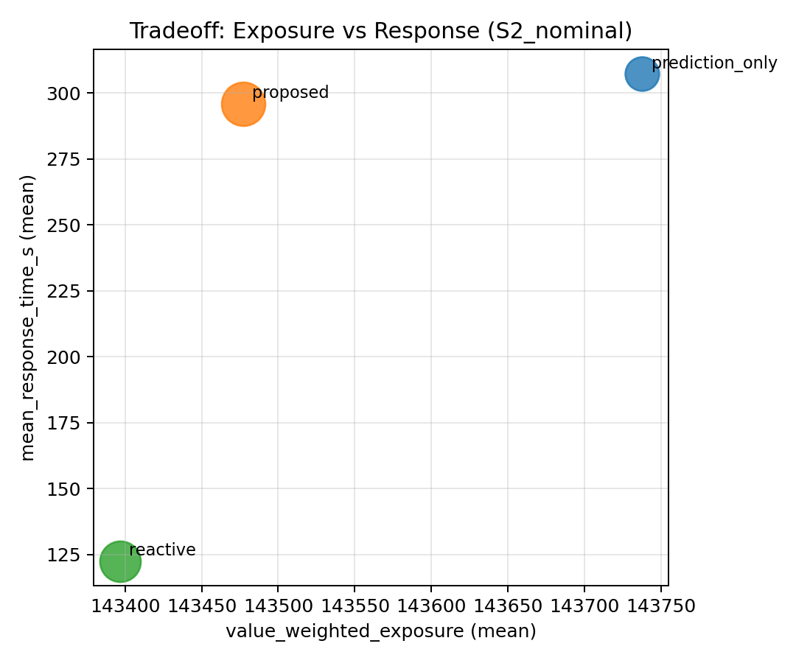
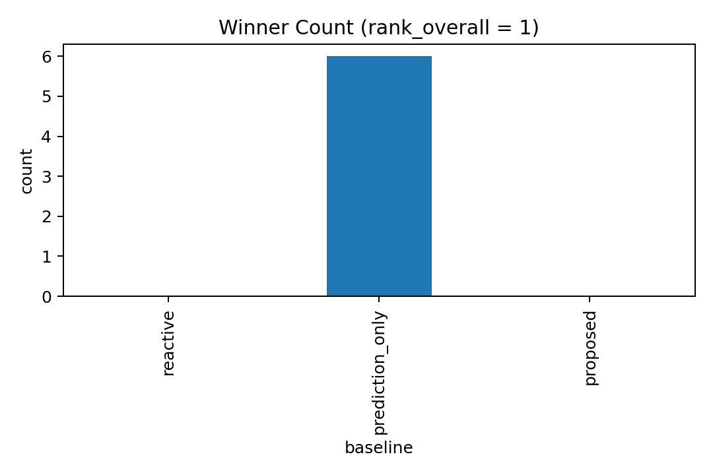
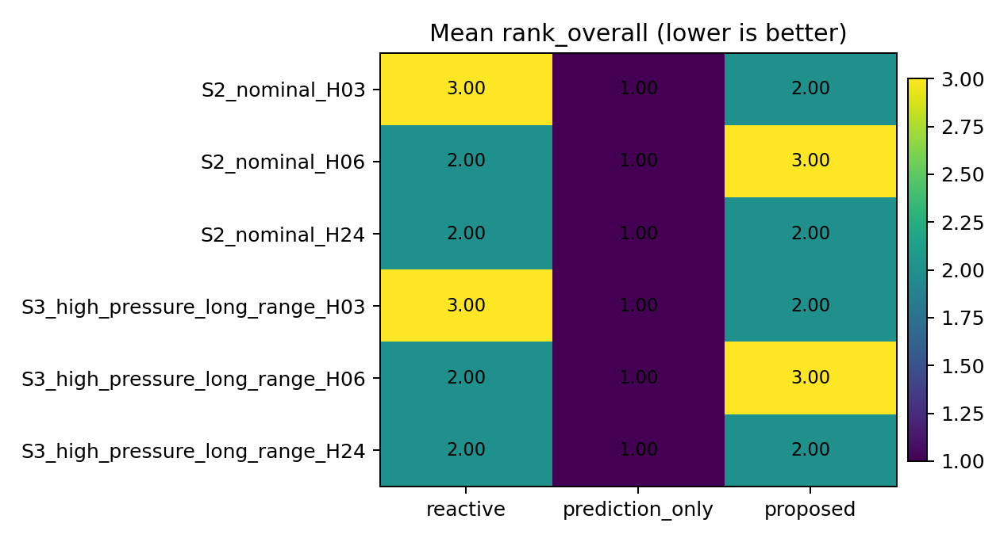

# Vineyard Robot Deterrent System

This repository contains a simulation framework for multi-robot bird deterrence in vineyard-like environments.  
It implements an intervention-aware spatiotemporal intensity model, decentralized zone coordination, task generation/scoring, and experiment runners for thesis evaluation.

## What This Repo Includes

- **Online intensity model (`SESTPP.py`)**
  - Self-exciting trigger mass + inhibitory intervention mass
  - Separate temporal decays and spatial stamping
- **Robot + zone coordination (`Robot.py`, `ZonePartitioner.py`)**
  - Health-weighted zone partitioning and neighbor sharing
  - Boundary event exchange (detections + interventions)
- **Task generation and scoring (`TaskGenerator.py`)**
  - Candidate generation from hotspots
  - Benefit-vs-cost action scoring for patrol and deterrence
- **System simulation (`DeterrentSystem.py`)**
  - Ground-truth event process
  - Closed-loop intervention feedback
  - Metrics collection and baseline comparisons
- **Monitoring and telemetry (`telemetry_sim.py`, `streamlit_app.py`)**
  - Live telemetry CSV output
  - Streamlit dashboard with map/tasks/robot diagnostics
- **Experiment scripts**
  - `run_24h_experiment.py` (sequential 24h sweep, headless, thesis summary outputs)
  - `run_24h_experiment_parallel.py` (multiprocessing 24h sweep, headless, faster)
  - `demo_optimal_proposed.py` (single-file visual demo using best proposed config)

## Quick Start

From repo root:

```powershell
python -m py_compile DeterrentSystem.py TaskGenerator.py SESTPP.py
```

Run the base 24h sweep (sequential):

```powershell
python run_24h_experiment.py
```

Run faster parallel sweep:

```powershell
python run_24h_experiment_parallel.py --profile fast --max-workers 12
```

Run a visual demo of the best proposed configuration (from summary CSV):

```powershell
python demo_optimal_proposed.py
```

Save demo as video:

```powershell
python demo_optimal_proposed.py --duration-s 1800 --fps 10 --save-path demo.mp4
```

Launch live dashboard (if telemetry is being flushed by a running sim):

```powershell
streamlit run streamlit_app.py
```

## Thesis Evaluation Order

Use the staged thesis workflow in [`EXPERIMENT_EXECUTION_ORDER.md`](EXPERIMENT_EXECUTION_ORDER.md). Each stage runner now writes a README into its output directory describing:

- the question that stage answers,
- the metrics that matter,
- what counts as failure before you proceed to the next stage.

## Outputs

Typical experiment outputs include:

- baseline comparison CSVs (mean/variance metrics)
- per-run metrics CSVs
- experiment manifest CSVs (parameter traceability)
- thesis summary CSV/Markdown (sequential script)
- profile-specific parallel outputs (`*_parallel_fast.csv`, `*_parallel_final.csv`)

## Results Snapshot

After running experiments and plotting (`python plot_experiment_results.py`), key figures are saved in `results/`.

Most important plots to review:

- `results/boxplot_exposure.png` (primary outcome: value-weighted exposure)
- `results/boxplot_response_time.png` (responsiveness)
- `results/boxplot_task_efficiency.png` (task efficiency)
- `results/tradeoff_exposure_vs_response_S2_nominal.png` (core tradeoff view)
- `results/winner_count_by_baseline.png` (who wins across settings)
- `results/mean_rank_heatmap.png` (ranking stability by scenario)

### Key Plots

Value-weighted exposure (primary metric):



Response time distribution:



Task efficiency distribution:



Exposure vs response tradeoff (nominal scenario):



Win count and ranking stability:




You can also open the generated summary tables:

- `thesis_summary_24h_sweep.csv` / `thesis_summary_24h_sweep.md` (sequential)
- `thesis_summary_24h_sweep_parallel.csv` / `thesis_summary_24h_sweep_parallel.md` (parallel)

## Experiments Documentation

Detailed instructions for experiment workflows and CLI options are in:

- `EXPERIMENTS.md`
- `EXPERIMENT_EXECUTION_ORDER.md`

## Notes on Visualization vs Batch Runs

- `run_24h_experiment.py` and `run_24h_experiment_parallel.py` are configured for **headless batch data collection** (no visualization).
- `demo_optimal_proposed.py` is intended for **visual presentation/demo** of a selected best proposed configuration.
